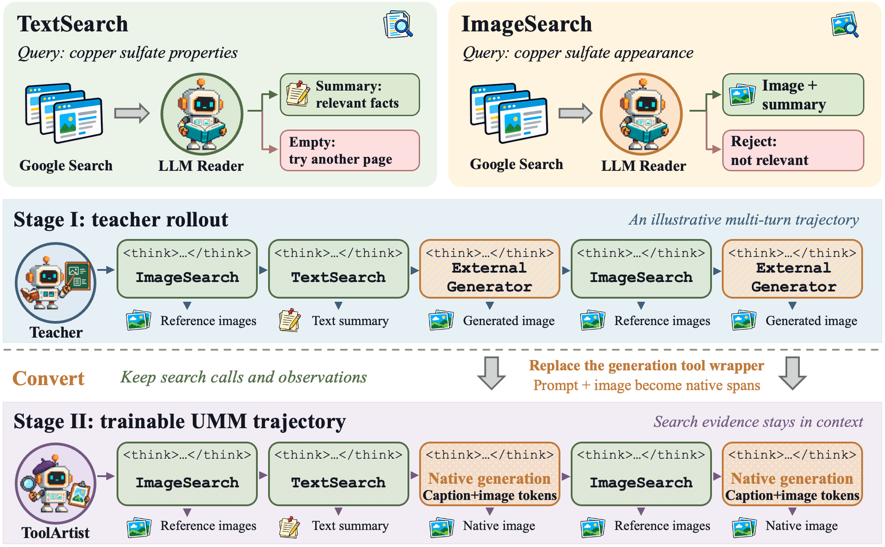

<div align="center">


# 🎨 ToolArtist : Tool-using UMM for Agnetic Image Gen

</div>

<a id="showcase"></a>
## 🖼️ Showcase

The following gallery is composed entirely of images generated by **ToolArtist**.

<p align="center">
  
</p>

<a id="overview"></a>
## 💡 Overview

ToolArtist is an **agentic image generation model** post-trained from Emu3.5. It can search the web, retrieve visual references, read external information, generate images, and refine its answer over multiple tool-use rounds.

This repository follows a two-stage post-training recipe:

1. **SFT** — collect tool-use rollouts, convert successful trajectories into multimodal training samples, and fine-tune Emu3.5.
<p align="center">
  
</p>

2. **RL** — let the SFT model perform online agentic rollouts and optimize the policy with GRPO.


## 📚 Contents

- [Showcase](#showcase)
- [Overview](#overview)
- [Repository Layout](#repository-layout)
- [1. Supervised Fine-Tuning](#sft)
  - [Teacher Data Rollout](#teacher-rollout)
  - [SFT Training](#sft-training)
- [2. Reinforcement Learning](#rl)
  - [ToolArtist Rollout](#toolartist-rollout)
  - [RL Training](#rl-training)
- [Acknowledgements](#acknowledgements)


<a id="repository-layout"></a>
## 📁 Repository Layout

```text
EMU-Agentic-PostTrain/
├── Agentic_Image_Gen/       # canonical agent loop and standalone rollout service
├── DataRoller/              # data construction with search/read/draw tools
├── Emu3.5/                  # Emu3.5 model code and tokenizer
├── RL/
│   ├── UniVR_RL/            # GRPO training framework and agentic rollout backend
│   └── UniVR_SFT/           # supporting Emu3.5 components
├── SFT/                     # trajectory conversion, verification, and SFT scripts
├── env_scripts/             # reproducible SFT/RL environments and Dockerfiles
└── show/                    # overview and method figures
```

<a id="sft"></a>
## 1. 🧑‍🏫 Supervised Fine-Tuning

The SFT stage has two steps: first collect tool-use trajectories from a teacher model, then normalize and convert those trajectories to fine-tune Emu3.5.

<a id="teacher-rollout"></a>
### 1.1 🎓 Teacher Data Rollout

`DataRoller/` runs a ReAct-style multimodal agent over image-generation requests. During a rollout, the agent can call:

- `text_search` for factual web retrieval;
- `image_search` for visual references;
- `draw` for image generation and editing.

#### 🛠️ Environment

Python 3.10 or newer is recommended for data construction.

```bash
conda create -n toolartist-data python=3.10 -y
conda activate toolartist-data

pip install "qwen-agent[gui,rag,code_interpreter,mcp]"
pip install soundfile openai pillow requests tiktoken rich
```

Configure the API credentials, model name, dataset name, output directory, and rollout limit in:

```text
DataRoller/scrpits/run.sh
```

Replace the placeholder values for the Ark model, Serper search, and Gemini image-generation services before running the script.

#### 📖 Input Data

Place one JSON object per line in `DataRoller/data/<dataset>.jsonl`:

```json
{"idx": 1, "question": "Create a cinematic image of ...", "answer": ""}
```

- `question` is the image-generation request.
- `answer` is retained in the rollout record and may be an empty placeholder.
- `idx` is optional.

An example SFT rollout input is included:

```text
DataRoller/data/gen_sft.jsonl
```

#### 🏃 Run

```bash
cd DataRoller
bash scrpits/run.sh
```

The main trajectory file is written to:

```text
DataRoller/outputs/<model_name>/<dataset>/iter1.jsonl
```

Generated images are written under `DataRoller/outputs/` by default. Override the location with `DRAW_OUTPUT_DIR`.

<a id="sft-training"></a>
### 1.2 🚀 SFT Training

The SFT stage converts agent trajectories into tokenized interleaved text-image samples, optionally decodes selected samples for visual verification, and fine-tunes an Emu3.5 checkpoint with DeepSpeed ZeRO-2.

#### 🛠️ Environment

The recommended runtime is Python 3.12, PyTorch 2.8.0, CUDA 12.8.

##### Option A: Docker

```bash
bash env_scripts/build_images.sh sft

docker run --gpus all -it --rm \
  -v "$(pwd)":/workspace \
  local/univr-sft:cu128-py312
```

##### Option B: Conda

```bash
conda create -n toolartist-sft python=3.12 -y
conda activate toolartist-sft
bash env_scripts/sft_env.sh
```

#### ✏️ Prepare Data

Prepare the following local assets:

```text
DataRoller/outputs/<model_name>/<dataset>/iter1.jsonl  # teacher rollouts from Section 1.1
Data/SFT/image/                                        # local copy or symlink of rollout images
Emu3.5-VisionTokenizer/                               # VQ tokenizer checkpoint
checkpoints/Emu3.5/                                   # base model checkpoint
```

Copy or symlink the images referenced by the rollout JSONL into `Data/SFT/image/` before conversion.

Normalize legacy prompts by replacing them with the current English prompt template:

```bash
INPUT="$PWD/DataRoller/outputs/<model_name>/<dataset>/iter1.jsonl" \
OUTPUT="$PWD/Data/SFT/normalized_rollout.jsonl" \
bash SFT/replace.sh
```

`SFT/replace.sh` calls `SFT/replace_pe.py`, which loads the current system and user prompts from `SFT/PE.py` while preserving each sample's original question and tool trajectory.

Convert the rollout traces on eight GPUs:

```bash
INPUT="$PWD/Data/SFT/normalized_rollout.jsonl" \
TOOL_RESP_DIR="$PWD/Data/SFT/image" \
NUM_GPUS=8 \
bash SFT/prepare_v2.sh
```

Useful overrides include:

```bash
INPUT=/path/to/raw.jsonl \
OUTPUT=/path/to/sft.jsonl \
TOOL_RESP_DIR=/path/to/images \
VQ_PATH=/path/to/Emu3.5-VisionTokenizer \
NUM_GPUS=8 \
bash SFT/prepare_v2.sh
```

The default converted dataset is:

```text
Data/SFT/converted_v2/sft.jsonl
```


#### 🏃 Run

Launch single-node distributed SFT:

```bash
MODEL_PATH="$PWD/checkpoints/Emu3.5" \
TRAIN_DATA="$PWD/Data/SFT/converted_v2/sft.jsonl" \
OUTPUT_DIR="$PWD/outputs/sft" \
NUM_GPUS=8 \
bash SFT/sft.sh
```

The default recipe uses BF16, FlashAttention 2, DeepSpeed ZeRO-2, a maximum sequence length of 32,768, and one training epoch. Adjust the exported paths or `SFT/sft.sh` for your hardware and training schedule.

<a id="rl"></a>
## 2. 🔥 Reinforcement Learning

The RL stage starts from the SFT checkpoint and trains it with GRPO.

#### 🛠️ Environment

The public RL image targets Python 3.12, PyTorch 2.8.0, CUDA 12.8/12.9 components, vLLM 0.11.0, Ray 2.52.1, DeepSpeed, and the local UniVR-based RL stack.

```bash
bash env_scripts/build_images.sh rl

docker run --gpus all -it --rm \
  --ipc=host \
  -v "$(pwd)":/workspace \
  local/univr-rl:cu128-py312
```

Prepare these local assets:

```text
checkpoints/emu3p5-sft/                 # checkpoint produced by SFT
checkpoints/Emu3.5-VisionTokenizer/     # VQ tokenizer
Data/RL/gen_rl.jsonl                    # RL prompts
```

The default RL reward uses a Doubao judge. You may replace it with another OpenAI-compatible judge by setting the corresponding model, API key, and base URL:

```bash
export ARK_API_KEY="your-ark-api-key"
export ARK_MODEL="doubao-seed-2-0-pro-260215"
export ARK_BASE_URL="https://ark.cn-beijing.volces.com/api/v3"

# Optional: disable online Weights & Biases logging.
export EMU_DISABLE_WANDB=1
```

<a id="toolartist-rollout"></a>
### 2.1 🎭 ToolArtist Rollout

The standalone mode runs the same canonical agent loop without launching RL training. Use it to verify a checkpoint, debug tools, inspect trajectories, or generate evaluation samples.

#### Single-Server Rollout

Start the model service in the first terminal:

```bash
EMU_MODEL_PATH="$PWD/checkpoints/emu3p5-sft" \
EMU_VQ_PATH="$PWD/checkpoints/Emu3.5-VisionTokenizer" \
EMU_ROOT="$PWD/Emu3.5" \
EMU_IMAGE_SAVE_DIR="$PWD/outputs/rollout/images" \
CUDA_VISIBLE_DEVICES=0,1 \
bash Agentic_Image_Gen/start.sh
```

Run the client in a second terminal:

```bash
EMU_SERVER_URL="http://127.0.0.1:23333" \
IMAGE_SAVE_DIR="$PWD/outputs/rollout/images" \
bash Agentic_Image_Gen/run.sh \
  "$PWD/Data/RL/gen_rl.jsonl" \
  "$PWD/outputs/rollout"
```

The resulting trajectory file is written to:

```text
outputs/rollout/emu3p5-sft/gen_rl/iter1.jsonl
```

#### Multi-GPU Rollout

For one rollout server per GPU, start the replicas and then launch the sharded clients:

```bash
GPUS=0,1,2,3,4,5,6,7 \
EMU_MODEL_PATH="$PWD/checkpoints/emu3p5-sft" \
EMU_VQ_PATH="$PWD/checkpoints/Emu3.5-VisionTokenizer" \
bash Agentic_Image_Gen/start_all.sh
```

In another terminal:

```bash
GPUS=0,1,2,3,4,5,6,7 \
DATA_ROOT="$PWD/Data/RL" \
DATASET_NAME="gen_rl" \
bash Agentic_Image_Gen/run_all.sh
```

`run_all.sh` shards the JSONL round-robin, writes per-GPU logs and outputs under `Agentic_Image_Gen/workspace/`, and merges successful shard results into a `.merged` result directory.

<a id="rl-training"></a>
### 2.2 🏋️ RL Training

```bash
EMU_MODEL_PATH="$PWD/checkpoints/emu3p5-sft" \
EMU_VQ_PATH="$PWD/checkpoints/Emu3.5-VisionTokenizer" \
EMU_AGENTIC_TRAIN_DATA="$PWD/Data/RL/gen_rl.jsonl" \
ARK_API_KEY="$ARK_API_KEY" \
EMU_DISABLE_WANDB=1 \
bash RL/UniVR_RL/examples/emu_agentic_grpo.sh
```

The launcher reads its GRPO, rollout, reward, and trainer settings from `RL/UniVR_RL/examples/config_emu_agentic.yaml`.

To log online, omit `EMU_DISABLE_WANDB=1`, run `wandb login`, and optionally set `WANDB_ENTITY`.

Training artifacts are saved under:

```text
RL/experiments/<experiment_name>/
├── train_<timestamp>.log
├── images/stepNNN/
├── traces/stepNNN.jsonl
└── checkpoints/
```

Override `EXPERIMENT_NAME`, `PROJECT_NAME`, rollout limits, model paths, or sampling variables through environment variables defined in the launcher.

<a id="acknowledgements"></a>
## 🙏 Acknowledgements

We sincerely thank **UniVR team** for their excellent work and open-source repository. The RL infrastructure in this project builds on and adapts components from [UniVR](https://github.com/MaverickRen/UniVR). We are grateful to the authors for making their research and code available to the community.

We also thank the developers and maintainers of [Emu3.5](https://github.com/BAAI-DCAI/Emu3.5) and the broader open-source community.
