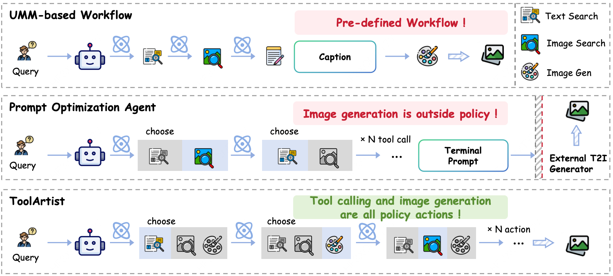

<div align="center">

# ToolArtist: Agentic Post-Training for Image Generation

**Data construction, supervised fine-tuning, and reinforcement learning for tool-augmented image generation agents**

[](https://github.com/bubble65/EMU-Agentic-PostTrain)
[](https://www.python.org/)

</div>

ToolArtist is an end-to-end post-training stack for an **agentic image generation model**. The agent can search the web, retrieve visual references, read external information, generate images, inspect intermediate results, and refine its answer over multiple tool-use rounds.

The repository follows a three-stage recipe:

1. **Data Construction** — roll out multi-turn tool-use trajectories.
2. **SFT** — convert successful trajectories into tokenized multimodal samples and fine-tune Emu3.5.
3. **RL** — optimize the SFT checkpoint with agentic GRPO and online image-generation rollouts.

<p align="center">
  
</p>

## Contents

- [Method](#method)
- [Repository Layout](#repository-layout)
- [1. Data Construction](#1-data-construction)
- [2. Supervised Fine-Tuning](#2-supervised-fine-tuning)
- [3. Reinforcement Learning](#3-reinforcement-learning)
  - [Standalone Rollout](#31-standalone-rollout)
  - [RL Training](#32-rl-training)
- [Acknowledgements](#acknowledgements)

## Method

ToolArtist first collects agent trajectories with external search and image-generation tools. Successful trajectories are converted into the Emu3.5 interleaved text-image token format for cold-start SFT. The resulting checkpoint is then optimized with GRPO: each prompt produces a group of online agentic rollouts, and the policy is updated using format, drawing, caption-quality, and image-quality rewards.

<p align="center">
  
</p>

## Repository Layout

```text
EMU-Agentic-PostTrain/
├── Agentic_Image_Gen/       # canonical agent loop and standalone rollout service
├── DataRoller/              # data construction with search/read/draw tools
├── Emu3.5/                  # Emu3.5 model code and tokenizer
├── RL/
│   ├── UniVR_RL/            # GRPO training framework and agentic rollout backend
│   └── UniVR_SFT/           # supporting Emu3.5 components
├── SFT/                     # trajectory conversion, verification, and SFT scripts
├── env_scripts/             # reproducible SFT/RL environments and Dockerfiles
└── show/                    # overview and method figures
```

Clone the repository and enter its root directory before following the commands below:

```bash
git clone git@github.com:bubble65/EMU-Agentic-PostTrain.git
cd EMU-Agentic-PostTrain
```

> [!IMPORTANT]
> Model checkpoints, raw datasets, converted data, generated images, and experiment outputs are intentionally excluded from Git. Prepare them locally under the paths shown below. Never commit API keys.

## 1. Data Construction

`DataRoller/` runs a ReAct-style multimodal agent over image-generation requests. During a rollout, the agent can call:

- `text_search` for factual web retrieval;
- `image_search` for visual references;
- `reader` for query-focused page extraction;
- `draw` for image generation and editing.

The full conversation, tool calls, final prediction, output image path, and termination state are saved as JSONL and can be used to prepare SFT or RL data.

### Environment

Python 3.10 or newer is recommended for data construction.

```bash
conda create -n toolartist-data python=3.10 -y
conda activate toolartist-data

pip install "qwen-agent[gui,rag,code_interpreter,mcp]"
pip install soundfile openai pillow requests tiktoken rich
```

Configure the model and tool services:

```bash
# Main rollout model and document reader
export ARK_API_KEY="your-ark-api-key"
export ARK_MODEL="doubao-seed-2-0-pro-260215"
export ARK_BASE_URL="https://ark.cn-beijing.volces.com/api/v3"

# Text and image search
export SERPER_API_KEY="your-serper-api-key"

# Image generation / editing
export GEMINI_API_KEY="your-gemini-api-key"
export GEMINI_BASE_URL="https://generativelanguage.googleapis.com/v1beta"
export GEMINI_MODEL="gemini-3-pro-image"
export GEMINI_ASPECT_RATIO="4:3"
export GEMINI_IMAGE_SIZE="1K"
export GEMINI_RESPONSE_MIME_TYPE="image/png"
```

Optional runtime controls:

```bash
export MODEL_NAME="doubao2.0"
export DATASET="gen_sft"
export OUTPUT_PATH="./outputs"
export MAX_ITEMS=10
export MAX_OUTPUT_TOKENS=4096
export TEMPERATURE=0.0
export TOP_P=1.0
```

### Input Data

Place one JSON object per line in `DataRoller/data/<dataset>.jsonl`:

```json
{"idx": 1, "question": "Create a cinematic image of ...", "answer": ""}
```

- `question` is the image-generation request.
- `answer` is retained in the rollout record and may be an empty placeholder.
- `idx` is optional.

Two example inputs are included:

```text
DataRoller/data/gen_sft.jsonl
DataRoller/data/gen_rl.jsonl
```

### Run

Start with a small batch:

```bash
cd DataRoller

python3 -u run_multi_react.py \
  --model "$ARK_MODEL" \
  --model_name "$MODEL_NAME" \
  --dataset "$DATASET" \
  --output "$OUTPUT_PATH" \
  --max_items "$MAX_ITEMS"
```

Or use the helper script after replacing its `ark-xxx` and `xxx` credential placeholders:

```bash
cd DataRoller
bash scrpits/run.sh
```

> [!WARNING]
> `DataRoller/scrpits/run.sh` clears the configured dataset output directory before starting. Invoke `run_multi_react.py` directly when previous rollouts must be preserved.

The main trajectory file is written to:

```text
DataRoller/outputs/<model_name>/<dataset>/iter1.jsonl
```

Generated images are written under `DataRoller/outputs/` by default. Override the location with `DRAW_OUTPUT_DIR`.

## 2. Supervised Fine-Tuning

The SFT stage converts agent trajectories into tokenized interleaved text-image samples, optionally decodes selected samples for visual verification, and fine-tunes an Emu3.5 checkpoint with DeepSpeed ZeRO-2.

### Environment

The recommended runtime is Python 3.12, PyTorch 2.8.0, CUDA 12.8, and eight GPUs.

#### Option A: Docker

```bash
bash env_scripts/build_images.sh sft

docker run --gpus all -it --rm \
  -v "$(pwd)":/workspace \
  local/univr-sft:cu128-py312
```

#### Option B: Conda

```bash
conda create -n toolartist-sft python=3.12 -y
conda activate toolartist-sft
bash env_scripts/sft_env.sh
```

### Prepare Data

Prepare the following local assets:

```text
Data/SFT/UPE_raw_gensearcher_sft_trace_relpath.jsonl  # rollout trajectories
Data/SFT/image/                                       # referenced tool images
Emu3.5-VisionTokenizer/                               # VQ tokenizer checkpoint
checkpoints/Emu3.5/                                   # base model checkpoint
```

Convert the rollout traces on eight GPUs:

```bash
NUM_GPUS=8 bash SFT/prepare_v2.sh
```

Useful overrides include:

```bash
INPUT=/path/to/raw.jsonl \
OUTPUT=/path/to/sft.jsonl \
TOOL_RESP_DIR=/path/to/images \
VQ_PATH=/path/to/Emu3.5-VisionTokenizer \
NUM_GPUS=8 \
bash SFT/prepare_v2.sh
```

The default converted dataset is:

```text
Data/SFT/converted_v2/sft.jsonl
```

Before a full run, optionally decode several converted samples:

```bash
python3 SFT/verify_sample.py \
  --sft Data/SFT/converted_v2/sft.jsonl \
  --raw Data/SFT/UPE_raw_gensearcher_sft_trace_relpath.jsonl \
  --tool-resp-dir Data/SFT/image \
  --vq-path Emu3.5-VisionTokenizer \
  --tokenizer-path Emu3.5/src/tokenizer_emu3_ibq \
  --out SFT/verify_out \
  --line-nos 1 5 11
```

### Run

Launch single-node distributed SFT:

```bash
MODEL_PATH="$PWD/checkpoints/Emu3.5" \
TRAIN_DATA="$PWD/Data/SFT/converted_v2/sft.jsonl" \
OUTPUT_DIR="$PWD/outputs/sft" \
NUM_GPUS=8 \
bash SFT/sft.sh
```

The default recipe uses BF16, FlashAttention 2, DeepSpeed ZeRO-2, a maximum sequence length of 32,768, and one training epoch. Adjust the exported paths or `SFT/sft.sh` for your hardware and training schedule.

## 3. Reinforcement Learning

The RL stage starts from the SFT checkpoint and trains it with GRPO. For every prompt, the policy executes a multi-turn agent loop, uses search and image tools, renders a final image, and receives a combined format/draw/caption/image reward.

### Environment

The public RL image targets Python 3.12, PyTorch 2.8.0, CUDA 12.8/12.9 components, vLLM 0.11.0, Ray 2.52.1, DeepSpeed, and the local UniVR-based RL stack.

```bash
bash env_scripts/build_images.sh rl

docker run --gpus all -it --rm \
  --ipc=host \
  -v "$(pwd)":/workspace \
  local/univr-rl:cu128-py312
```

Prepare these local assets:

```text
checkpoints/emu3p5-sft/                 # checkpoint produced by SFT
checkpoints/Emu3.5-VisionTokenizer/     # VQ tokenizer
Data/RL/gen_rl.jsonl                    # RL prompts
```

The RL reward uses an Ark/Doubao judge. Export its credentials inside the runtime:

```bash
export ARK_API_KEY="your-ark-api-key"
export ARK_MODEL="doubao-seed-2-0-pro-260215"
export ARK_BASE_URL="https://ark.cn-beijing.volces.com/api/v3"

# Optional: disable online Weights & Biases logging.
export EMU_DISABLE_WANDB=1
```

### 3.1 Standalone Rollout

The standalone mode runs the same canonical agent loop without launching RL training. Use it to verify a checkpoint, debug tools, inspect trajectories, or generate evaluation samples.

#### Single-server rollout

Start the model service in the first terminal:

```bash
EMU_MODEL_PATH="$PWD/checkpoints/emu3p5-sft" \
EMU_VQ_PATH="$PWD/checkpoints/Emu3.5-VisionTokenizer" \
EMU_ROOT="$PWD/Emu3.5" \
EMU_IMAGE_SAVE_DIR="$PWD/outputs/rollout/images" \
CUDA_VISIBLE_DEVICES=0,1 \
bash Agentic_Image_Gen/start.sh
```

Run the client in a second terminal:

```bash
EMU_SERVER_URL="http://127.0.0.1:23333" \
IMAGE_SAVE_DIR="$PWD/outputs/rollout/images" \
bash Agentic_Image_Gen/run.sh \
  "$PWD/Data/RL/gen_rl.jsonl" \
  "$PWD/outputs/rollout"
```

The resulting trajectory file is written to:

```text
outputs/rollout/emu3p5-sft/gen_rl/iter1.jsonl
```

#### Multi-GPU rollout

For one rollout server per GPU, start the replicas and then launch the sharded clients:

```bash
GPUS=0,1,2,3,4,5,6,7 \
EMU_MODEL_PATH="$PWD/checkpoints/emu3p5-sft" \
EMU_VQ_PATH="$PWD/checkpoints/Emu3.5-VisionTokenizer" \
bash Agentic_Image_Gen/start_all.sh
```

In another terminal:

```bash
GPUS=0,1,2,3,4,5,6,7 \
DATA_ROOT="$PWD/Data/RL" \
DATASET_NAME="gen_rl" \
bash Agentic_Image_Gen/run_all.sh
```

`run_all.sh` shards the JSONL round-robin, writes per-GPU logs and outputs under `Agentic_Image_Gen/workspace/`, and merges successful shard results into a `.merged` result directory.

### 3.2 RL Training

The current launcher is configured for a single node with eight GPUs, 200 optimization steps, 16 prompts per rollout batch, and eight trajectories per prompt.

```bash
EMU_MODEL_PATH="$PWD/checkpoints/emu3p5-sft" \
EMU_VQ_PATH="$PWD/checkpoints/Emu3.5-VisionTokenizer" \
EMU_AGENTIC_TRAIN_DATA="$PWD/Data/RL/gen_rl.jsonl" \
ARK_API_KEY="$ARK_API_KEY" \
EMU_DISABLE_WANDB=1 \
bash RL/UniVR_RL/examples/emu_agentic_grpo_200step_big.sh
```

To log online, omit `EMU_DISABLE_WANDB=1`, run `wandb login`, and optionally set `WANDB_ENTITY`.

Important files:

- `RL/UniVR_RL/examples/emu_agentic_grpo_200step_big.sh` — paths, hardware, sampling settings, and launch command.
- `RL/UniVR_RL/examples/config_emu_agentic_200step_big.yaml` — GRPO, FSDP, rollout, reward, and trainer configuration.
- `RL/UniVR_RL/verl/workers/rollout/emu_agentic/` — in-process agentic rollout backend.
- `RL/UniVR_RL/examples/reward_function/emu_agentic_gensearcher_dual.py` — caption and image judge reward.
- `Agentic_Image_Gen/run.py` — canonical multi-turn agent behavior shared with standalone rollout.

Training artifacts are saved under:

```text
RL/experiments/<experiment_name>/
├── train_<timestamp>.log
├── images/stepNNN/
├── traces/stepNNN.jsonl
└── checkpoints/
```

Override `EXPERIMENT_NAME`, `PROJECT_NAME`, rollout limits, model paths, or sampling variables through environment variables defined in the launcher.

## Acknowledgements

We sincerely thank **Zhongwei Ren and the UniVR team** for their excellent work and open-source repository. The SFT/RL infrastructure in this project builds on and adapts components from [UniVR](https://github.com/MaverickRen/UniVR). We are grateful to the authors for making their research and code available to the community.

We also thank the developers and maintainers of [Emu3.5](https://github.com/BAAI-DCAI/Emu3.5), [verl](https://github.com/volcengine/verl), vLLM, DeepSpeed, and the broader open-source community.
